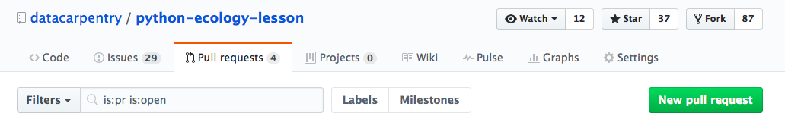
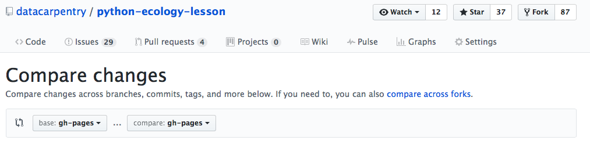
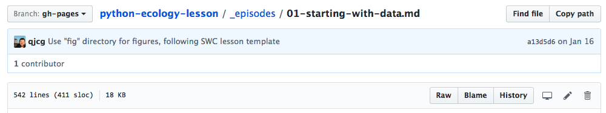
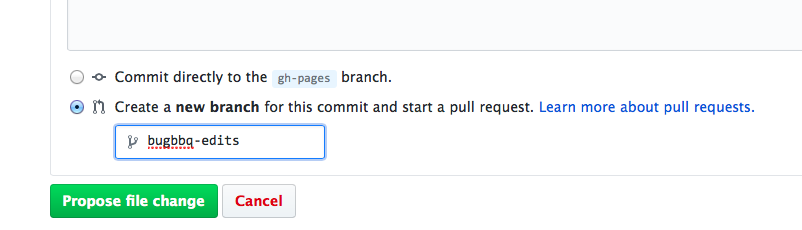

# How to Contribute to Lessons During the Bug BBQ

During the Bug BBQ we’ll be focusing on resolving outstanding issues. Issues for each of the lessons can be found here:

[Ecology Workshop Overview](https://github.com/datacarpentry/ecology-workshop)  
[Ecology Spreadsheets Lesson](https://github.com/datacarpentry/spreadsheet-ecology-lesson/issues/)  
[Ecology OpenRefine Lesson](https://github.com/datacarpentry/OpenRefine-ecology-lesson/issues/)  
[Ecology SQL Lesson](https://github.com/datacarpentry/sql-ecology-lesson/issues/)  
[Ecology R Lesson](https://github.com/datacarpentry/R-ecology-lesson/milestone/1)  
[Ecology Python Lesson](https://github.com/datacarpentry/python-ecology-lesson/issues/)  

## How to Contribute

### Step 1: Go to a lesson and look through the issues.

All the issues are labeled for the type of work that it is (formatting, wording, technical), how much time it will take (quickfix, moderate, complex) and the type of update (bug, enhancement, discussion). Some involve both technical and wording work, so have both labels.  

### Step 2: Select an issue to work on

Depending on the time you have and what you’re interested in working on, pick an issue. In the issue conversation, add a comment that says that you’re working on that issue.

### Step 3: Make the change needed to address the issue.

You can do this in two different ways

#### Approach 1: Using github on your computer

- Fork the repository
- Clone the repository to your computer
- Make a branch for this issue (if you're working on multiple unrelated issues, they should each have their own branch) and switch to work in that branch e.g. “git checkout -b bugbbq-edits”
- Make the changes
- If possible, review the rendered version of the lessons locally (link to information on how to do this - it’s somewhere)
- Push the changes e.g. “git push origin bugbbq-edits”
- Go to the datacarpentry repo that you forked the lessons from
- Click the Pull Requests tab and click the Green “New pull request” button

- Click ‘Compare across forks’

- Pick your repository and branch
- Click ‘Create pull request’
- Add a note about your Pull Request and be sure to add the link to the issue it resolves
- Click 'Create pull request'

#### Approach 2: Through the github website

- Find the file that you want to edit in the repository and click on that file
- Click on the pencil in the top right

- The file will now be open for you to edit it. Make your changes.
- After you’ve made your changes, scroll to the bottom of the page
- In the ‘Commit changes’ section add a commit message. Be sure to include a link to the issue the change addresses.
- Select the option “Create a new branch for this commit and start a pull request.” (That might the only option available to you.) Add a name for the branch.
- Click ‘Propose file change’

### Step 4: Revel in the success of putting in a Pull Request!

You’ve resolved issues today!

The maintainer may have follow up questions for you about your PR. If so, they’ll comment in the conversation in the PR and you can reply there. If you do need to make additional changes, you can make them in your same branch and push them and they’ll automatically be added to the Pull Request.
